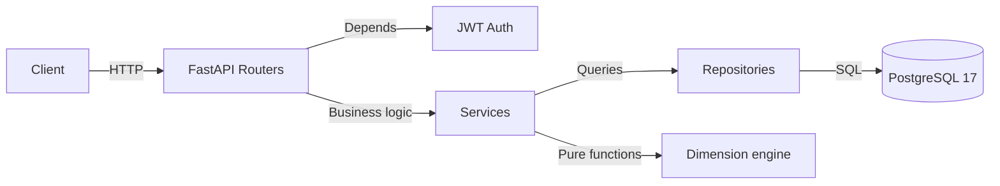

# Dimensional

[](https://github.com/vinodjanagal/dimensional/actions/workflows/ci.yml)

**Live:** https://dimensional.onrender.com — [API docs](https://dimensional.onrender.com/docs) · [Interactive demo](https://dimensional.onrender.com/redoc)

> Free tier spins down after 15 minutes of inactivity. First request may take ~30 seconds to wake the service.

A unit-aware, dimension-checking backend for physics and math notes.

Dimensional stores measurements, formulas, and derivations with one guarantee: **a dimensionally invalid formula cannot exist in the database.** Write `E = m · v²`, the API accepts. Write `E = m · v`, the API rejects — before the row is ever written.

## Why this exists

In 1999, NASA lost the Mars Climate Orbiter — a $327 million spacecraft — because one team supplied thruster data in pound-force-seconds and the other team's software assumed newton-seconds. The numbers were numerically similar. The dimensions were not. The spacecraft burned up in the Martian atmosphere.

Dimensional is a small defense against that class of bug. Every unit is encoded as a 7-dimensional integer vector. Every expression is parsed and its dimension computed. Every formula is validated against its declared result unit **before** it reaches the database. The Mars orbiter would not survive a POST to this API.

## What it does

- **Units as vectors.** 24 seeded units (7 SI base, 17 derived), each with a dimension encoded as a 7-tuple `(M, L, T, I, Θ, N, J)` of integer exponents.
- **Exact conversion.** `km → m`, `°C → K`, `g → kg`. Affine model (`value · factor + offset`). Uses `Decimal` / `NUMERIC(38, 20)`, never floating point.
- **Dimension algebra.** `multiply`, `divide`, `power` on the vectors — the entire algebra of physics, four lines of code.
- **Expression parser.** Parses `"kg * m / s ** 2"` using Python's `ast` module. Never `eval`. Rejects calls, attributes, subscripts, float exponents, variable exponents.
- **Write-time validation.** A formula is only stored if its expression's dimension matches its declared result unit. The check happens before the INSERT.
- **Notes, quantities, formulas.** Scoped to authenticated users. Foreign keys with `ON DELETE CASCADE`. Formula names are unique within a note.

## Architecture



**Layer responsibilities:**

- **Routers** — HTTP only. Translate domain exceptions to status codes.
- **Services** — Business logic. Own the invariants. Never import `HTTPException`.
- **Repositories** — Query gateways. Never contain `if` statements.
- **Physics engine** — Pure functions. No DB, no I/O, no async. Tested in isolation.
- **PostgreSQL** — Data and referential integrity. Named constraints, cascading FKs.

## Quickstart

Requires Docker and Python 3.13.

```bash
git clone https://github.com/vinodjanagal/dimensional.git
cd dimensional

cp .env.example .env      # edit POSTGRES_PASSWORD and SECRET_KEY

docker compose up -d db
docker compose run --rm migrator alembic upgrade head
docker compose run --rm api python -m scripts.seed_units

# API on http://localhost:8000/docs
docker compose up -d api
```

**Run the tests:**

```bash
docker compose up -d db
pytest -v
```

`pytest.ini` configures the test DB automatically. 129 tests run in about 15 seconds.

## The dimensional engine

The whole engine is two pure functions plus a tree walk.

**Dimension algebra** — units are 7-tuples of integer exponents. Multiplication, division, and power correspond to vector addition, subtraction, and scalar multiplication. Every physical unit is generated from these three operations on the 7 base dimensions:

```python
DIM_FORCE     = divide(multiply(DIM_MASS, DIM_LENGTH), power(DIM_TIME, 2))   # N
DIM_ENERGY    = multiply(DIM_FORCE, DIM_LENGTH)                              # J
DIM_POWER     = divide(DIM_ENERGY, DIM_TIME)                                 # W
DIM_PRESSURE  = divide(DIM_FORCE, power(DIM_LENGTH, 2))                      # Pa
```

**Expression parsing** — Python's `ast` module, not `eval`. The subset accepted is: names, numbers, `*`, `/`, `**`, parentheses, unary `+/-`. Everything else raises.

```python
>>> evaluate_dimension("kg * m / s ** 2", lookup)
(1, 1, -2, 0, 0, 0, 0)

>>> evaluate_dimension("kg * m / s", lookup)
(1, 1, -1, 0, 0, 0, 0)

>>> evaluate_dimension("foo * m", lookup)
ExpressionError: Unknown unit: 'foo'

>>> evaluate_dimension("m ** 1.5", lookup)
ExpressionError: Exponent must be a literal integer
```

**Write-time validation** — the invariant lives in `formula_service.create_formula()`. Check the note is owned, check the result unit exists, check the name is unique, then parse the expression, compute its dimension, compare. All before the INSERT.

```python
# app/services/formula_service.py (excerpt)
expr_dim = evaluate_dimension(expression, lookup.__getitem__)
expected_dim = tuple(result_unit.dimension)
if expr_dim != expected_dim:
    raise ValidationError(
        f"Expression has dimension {list(expr_dim)}, "
        f"but unit {result_unit_symbol!r} has {list(expected_dim)}"
    )
```

The test that proves it:

```python
async def test_create_invalid_formula_rejected(...):
    # E = m * v has dimension of momentum, not energy. Reject.
    response = await client.post(f"/notes/{note.id}/formulas", json={
        "name": "wrong_energy",
        "expression": "kg * (m / s)",
        "result_unit_symbol": "J",
    })
    assert response.status_code == 422

    # Nothing was written
    count = await session.execute(select(func.count()).select_from(Formula))
    assert count.scalar_one() == 0
```

Both assertions matter. The status code alone would pass even if we wrote the row and rolled back. The second assertion proves the INSERT never happened.

## API examples

Convert between compatible units:

```bash
curl -X POST localhost:8000/units/convert \
  -H "Content-Type: application/json" \
  -d '{"value": "5", "from_symbol": "km", "to_symbol": "m"}'
# {"value": "5000", "unit": "m", "input_value": "5", "input_unit": "km"}
```

Validate an expression against an expected unit:

```bash
curl -X POST localhost:8000/units/validate-expression \
  -H "Content-Type: application/json" \
  -d '{"expression": "kg * m / s ** 2", "expected_unit": "N"}'
# {"valid": true, "expression_dimension": [1, 1, -2, 0, 0, 0, 0], ...}

curl -X POST localhost:8000/units/validate-expression \
  -H "Content-Type: application/json" \
  -d '{"expression": "kg * m / s", "expected_unit": "N"}'
# {"valid": false, "message": "Expression has dimension [1, 1, -1, 0, 0, 0, 0], but unit 'N' has [1, 1, -2, 0, 0, 0, 0]"}
```

Create a note with a physics formula (requires auth):

```bash
curl -X POST localhost:8000/notes/1/formulas \
  -H "Authorization: Bearer $TOKEN" \
  -H "Content-Type: application/json" \
  -d '{"name": "kinetic_energy", "expression": "kg * (m / s) ** 2", "result_unit_symbol": "J"}'
# 201 Created

# Now write it wrong — this fails before the row is written
curl -X POST localhost:8000/notes/1/formulas \
  -H "Authorization: Bearer $TOKEN" \
  -H "Content-Type: application/json" \
  -d '{"name": "wrong_energy", "expression": "kg * (m / s)", "result_unit_symbol": "J"}'
# 422 Unprocessable Content
```

Full interactive docs at `/docs` (OpenAPI / Swagger UI) and `/redoc`.

## Testing

```bash
pytest -v
```

129 tests, ~15 seconds. Coverage:

- **27 tests** — auth, notes CRUD, ownership
- **21 tests** — dimension algebra (commutativity, associativity, distributivity)
- **24 tests** — expression parser (valid, invalid, edge cases)
- **21 tests** — units API (list, convert, check, validate)
- **8 tests** — physics cross-check (Newton, Joule, Watt, Pascal, Volt, Ohm)
- **8 tests** — formula and quantity endpoints
- **3 tests** — transaction semantics (flush, rollback, commit)
- **17 tests** — unit conversion (round-trips, temperature offsets)

The physics cross-check tests compare our computed dimensions against the BIPM SI Brochure (9th edition). If our algebra disagrees with a physics textbook, the tests fail.

## Roadmap

- **Uncertainty propagation** — first-class `value ± uncertainty` with chain-rule propagation through arithmetic (planned)
- **Derivations** — chain formulas so every result traces back to source measurements (planned)
- **Semantic search** — embeddings on notes and formulas, RAG over your own knowledge (planned)
- **Deployment** — public live instance (planned)

## Design notes

A few decisions that might look odd, and why:

- **`Decimal`, never `float`.** IEEE 754 cannot represent `0.1` exactly. Convert `0.1 km → cm → km` a thousand times with floats, and you get drift. `NUMERIC(38, 20)` does not. For a physics tool, exactness is not optional.
- **Named foreign keys.** Every FK is explicitly named (`fk_quantities_note_id_notes`). Autogenerate produces `None`, which breaks `alembic downgrade`. Named constraints are reversible.
- **Pure services, no DB in the engine.** `unit_service.convert`, `dimension.multiply`, and `expression.evaluate_dimension` take plain values and return plain values. 68 of the 129 tests run in under a second because they never touch a database.
- **Domain exceptions, not HTTP exceptions, in the service layer.** `formula_service.create_formula()` raises `ValidationError`, not `HTTPException`. The router translates. This lets CLI scripts, background jobs, and tests reuse the same service without faking HTTP.

## Deployment

| Component | Platform |
|---|---|
| API | Render Web Service |
| Database | Neon PostgreSQL |
| Queue | Upstash Redis |
| Worker | ARQ worker running in Docker |

### Architecture

The FastAPI API is deployed independently from the ARQ background
worker.

API requests that require asynchronous processing create a job and
enqueue it in Upstash Redis. The ARQ worker consumes jobs from Redis
and persists results to Neon PostgreSQL.

During the current portfolio/demo deployment, the ARQ worker runs
locally in Docker:

```bash
docker compose up worker

## License

MIT

## Author

Vinod Kumar — [github.com/vinodjanagal](https://github.com/vinodjanagal) — vinodjanagal.4910@gmail.com

