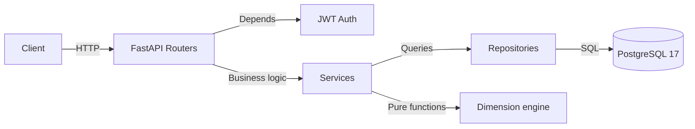

# Dimensional

[](https://github.com/vinodjanagal/dimensional/actions/workflows/ci.yml)

A unit-aware, dimension-checking backend for physics and math notes.

Dimensional stores measurements, formulas, and derivations with one guarantee: **a dimensionally invalid formula cannot exist in the database.** Write `E = m · v²`, the API accepts. Write `E = m · v`, the API rejects — before the row is ever written.

## Why this exists

In 1999, NASA lost the Mars Climate Orbiter — a $327 million spacecraft — because one team supplied thruster data in pound-force-seconds and the other team's software assumed newton-seconds. The numbers were numerically similar. The dimensions were not. The spacecraft burned up in the Martian atmosphere.

Dimensional is a small defense against that class of bug. Every unit is encoded as a 7-dimensional integer vector. Every expression is parsed and its dimension computed. Every formula is validated against its declared result unit **before** it reaches the database. The Mars orbiter would not survive a POST to this API.

## What it does

- **Units as vectors.** 24 seeded units (7 SI base, 17 derived), each with a dimension encoded as a 7-tuple `(M, L, T, I, Θ, N, J)` of integer exponents.
- **Exact conversion.** `km → m`, `°C → K`, `g → kg`. Affine model (`value · factor + offset`). Uses `Decimal` / `NUMERIC(38, 20)`, never floating point.
- **Dimension algebra.** `multiply`, `divide`, `power` on the vectors — the entire algebra of physics, four lines of code.
- **Expression parser.** Parses `"kg * m / s ** 2"` using Python's `ast` module. Never `eval`. Rejects calls, attributes, subscripts, float exponents, variable exponents.
- **Write-time validation.** A formula is only stored if its expression's dimension matches its declared result unit. The check happens before the INSERT.
- **Notes, quantities, formulas.** Scoped to authenticated users. Foreign keys with `ON DELETE CASCADE`. Formula names are unique within a note.

## Architecture



**Why Mermaid:** GitHub renders Mermaid natively. No external image files, no broken links, version-controlled alongside the code. If the diagram changes, the code and the diagram change in the same commit.

**Why the layer responsibilities:** This is the single most valuable paragraph for a reviewer. It tells them you understand **why** the code is organized the way it is, not just that it is organized. Most self-taught developers have files but not architecture.

---

## Section 5 — Quickstart

```markdown
## Quickstart

Requires Docker and Python 3.13.

```bash
git clone https://github.com/vinodjanagal/dimensional.git
cd dimensional

cp .env.example .env      # edit POSTGRES_PASSWORD and SECRET_KEY

docker compose up -d db
docker compose run --rm migrator alembic upgrade head
docker compose run --rm api python -m scripts.seed_units

# API on http://localhost:8000/docs
docker compose up -d api
'''
---
